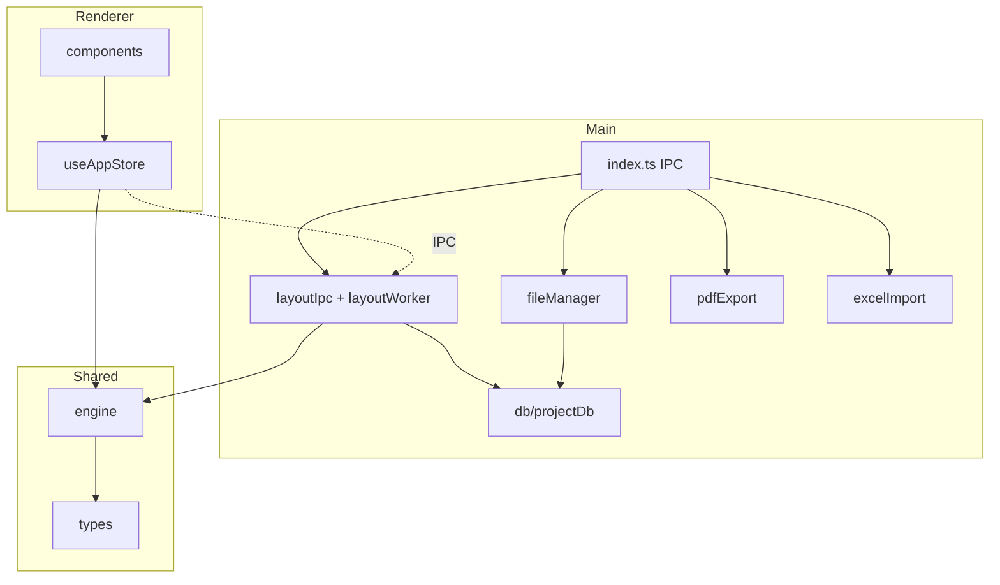

# PrintNest Pro 模块依赖说明（基线）

## 进程与目录边界

| 区域 | 路径 | 职责 |
|------|------|------|
| Main | `src/main/` | Electron 主进程：窗口、IPC、文件、PDF/Excel、SQLite、`Worker` 排版 |
| Preload | `src/main/preload.ts` | `contextBridge` 暴露 `window.electronAPI` |
| Renderer | `src/renderer/` | React UI、Zustand、画布与交互 |
| Shared | `src/shared/` | 纯 TS：类型、排版引擎、与 UI 无关的工具 |

渲染进程**不应**直接访问 Node/`fs`；跨进程能力一律经 `electronAPI`。

## 依赖关系（自上而下）

## 数据流摘要

1. **自动排版**：`useAppStore.runAutoLayout` → 若存在 `electronAPI.runLayoutJob` 则 IPC `layout:run` → 主进程 `Worker` 执行 `executeLayoutJob` → 可选写入 `layout_runs`；否则渲染进程直接 `runLayout`。
2. **项目文件**：`file:saveProject` / `file:loadProject` 读写 `{userData}/projects/{id}/project.json`；`ensureProjectLayout` 创建 `assets`、`exports`、`snapshots`、`temp`。
3. **数据库**：`project.db` 位于项目根目录，由 `better-sqlite3` 打开，`schema_migrations` + `layout_runs` 已启用。

## 与后续周次的衔接

- 领域类型草案：`src/shared/types/domain.ts`
- 完整 DDL 参考：`docs/schema/printnest_v1.sql`
- 回归样本：`fixtures/layout-samples/`
